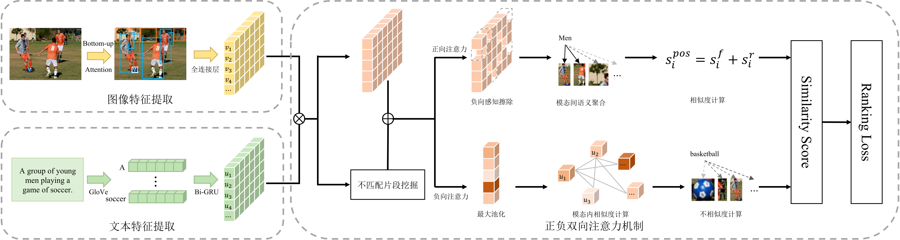

# PNBiAN: Pos-Neg Bidirectional Attention Network

  

Data Mining and Machine Learning Coursework Code.

## Framework

## Download Resources

- Pretrained Weight: [Link](https://pan.baidu.com/s/18PO4dghPVD_dq2q2f7-nhQ), the extraction code is: ti6k

- Data: We follow [SCAN](https://github.com/kuanghuei/SCAN) to obtain image features and vocabularies. Precomputed features are available at [here](https://www.kaggle.com/datasets/kuanghueilee/scan-features).
